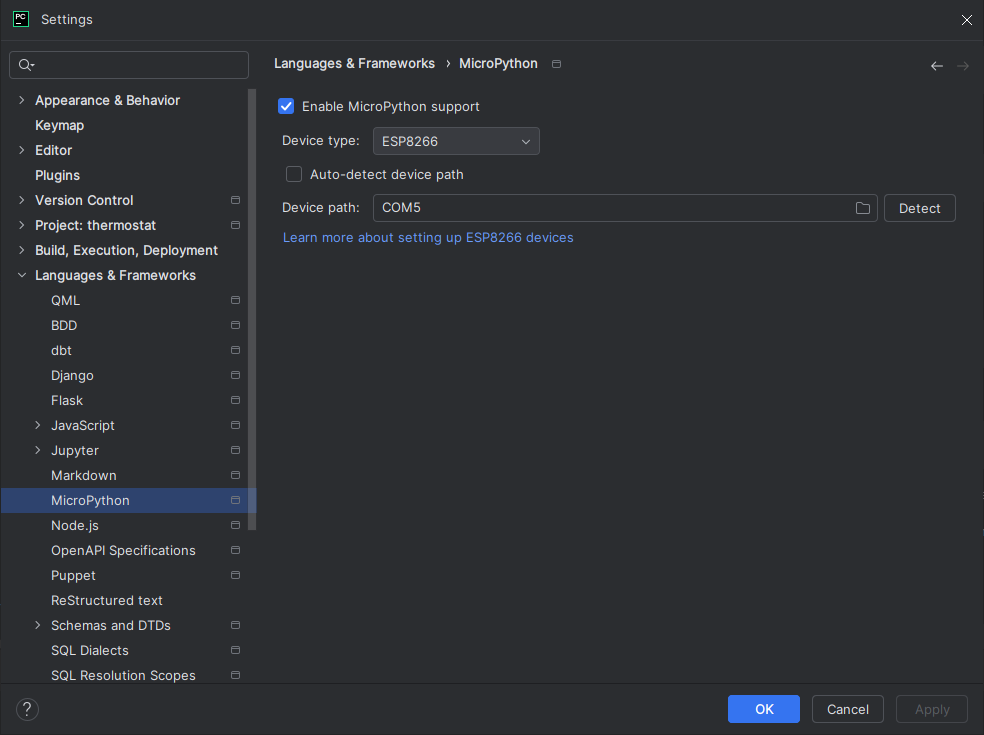

# Thermostat ESP32-S2 Project

This is a custom thermostat built for the [GroundStudio Carbon S2](https://github.com/GroundStudio/GroundStudio_Carbon_S2/tree/main) board.

The project uses MicroPython under the hood to create a functioning thermostat with many features!

See the official documentation for ESP32 and MicroPython [here](https://docs.micropython.org/en/latest/esp32/quickref.html#).

## IDE

The best IDE to use for MicroPython is PyCharm in combination with MicroPython plugin. Just know you will need to setup
it before it can be used:



## Virtual env

Install virtualenv:

```shell
pip install virtualenv;
```

Create a virtual env called `venv` in the current directory:

```shell
virtualenv venv
```

Activate the venv:

```shell
.\venv\Scripts\activate
```

Install the requirements from `requirements.txt` file:

```shell
pip install -r requirements.txt
```

## Conda

This project uses conda to manage the installed packages.

### Create a new conda environment

```shell
conda create --name thermostat --file requirements.txt
```

### Activate conda environment

```shell
conda activate thermostat
```

### Remove a conda environment

Make sure to deactivate the env using the command:

```shell
conda deactivate
```

Then remove the environment:

```shell
conda env remove -n thermostat
```

## Optimizing (external) libraries

To optimize the libraries (external or internal), mpy-cross command line tool is used. To install it, use pip:

```shell
pip install mpy-cross
```

To use it, run the CLI tool:

```shell
mpy-cross file.py
```

This will output a .mpy file which is the compiled version of the .py file. 
Upload this to the microcontroller instead of the original one to preserve space and computation power.

Place the newly created files into mpy_libraries directory so you can upload all of them using ampy command (see below).

## Working with files on the microcontroller

To work with files we can use ampy CLI tool.

### How to copy files to the microcontroller?

```shell
ampy -p COM5 put /mpy_libraries /libraries
```

This command can be used for regular files also (not only MPY).

PyCharm also automatically uploads boot.py when you run the file from the run button.

### How to list files on the microcontroller?

```shell
ampy -p COM5 ls
```