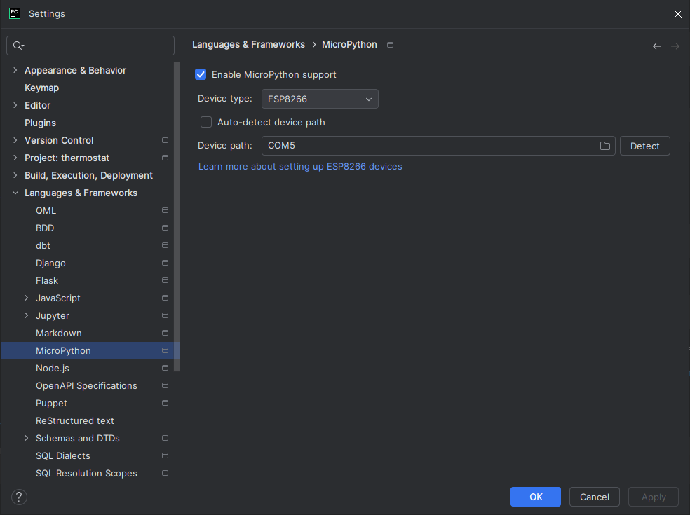

# Intelligent Thermostat Project

This is a custom thermostat built using [GroundStudio Carbon S2](https://github.com/GroundStudio/GroundStudio_Carbon_S2/tree/main) boards and various sensors.

The project uses MicroPython under the hood to create a functioning thermostat with many features!

See the official documentation for ESP32 and MicroPython [here](https://docs.micropython.org/en/latest/esp32/quickref.html#).

## Components

* GroundStudio Carbon S2 (or any ESP32)
* Temperature Sensor (AHT20 or OneWire)
* Gas Sensor (MQ-2)
* 3.3V or 5V Relay
* Resistors, capacitors
* MQTT Broker
* Home Assistant

### Thermometer

A simple temperature reporter. Sends the temperature readings every X seconds to Home Assistant.

### Gas Sensor

A simple gas sensor reporter. Reads the gas concentration from an MQ-2 sensor and sends it to Home Assistant every X seconds.

### Relay (Thermostat)

A simple relay controller with the job of switching on and off the heating system.

### Automations (in Home Assistant)

Automations that trigger based on the current temperature and/or gas readings and send on/off commands to the relay.

## IDE

The best IDE to use with MicroPython is PyCharm in combination with MicroPython plugin. Just know you will need to setup it before it can be used:



To use vscode read this article: https://micropython-stubs.readthedocs.io/en/main/22_vscode.html

### VSCode Settings File

```json
{
    "python.languageServer": "Pylance",
    "python.analysis.typeCheckingMode": "basic",
    "python.analysis.diagnosticSeverityOverrides": {
        "reportMissingModuleSource": "none"
    },
    "python.analysis.typeshedPaths": [
        ".venv/lib/python3.12/site-packages",
        "typings"
    ],
}
```

## Virtual env

Install virtualenv:

```shell
pip install virtualenv;
```

Create a virtual env called `.venv` in the current directory:

```shell
virtualenv .venv
```

Activate the venv:

```shell
.\.venv\Scripts\activate
```

For linux users:

```shell
source .venv/bin/activate
```

Install the requirements from `requirements.txt` file:

```shell
pip install --require-virtualenv -r requirements.txt
```

## Optimizing (external) libraries

To optimize the libraries (external or internal), mpy-cross command line tool is used. To install it, use pip:

```shell
pip install mpy-cross
```

To use it, run the CLI tool:

```shell
mpy-cross file.py
```

This will output a .mpy file which is the compiled version of the .py file.
Upload this to the microcontroller instead of the original one to preserve space and computation power.

Place the newly created files into mpy_libraries directory so you can upload all of them using ampy command (see below).

## Working with files on the microcontroller

To work with files we can use ampy CLI tool.

### How to copy files to the microcontroller?

```shell
ampy -p COM5 put /mpy_libraries /libraries
```

This command can be used for regular files also (not only MPY).

PyCharm also automatically uploads boot.py when you run the file from the run button.

### How to list files on the microcontroller?

```shell
ampy -p COM5 ls
```
